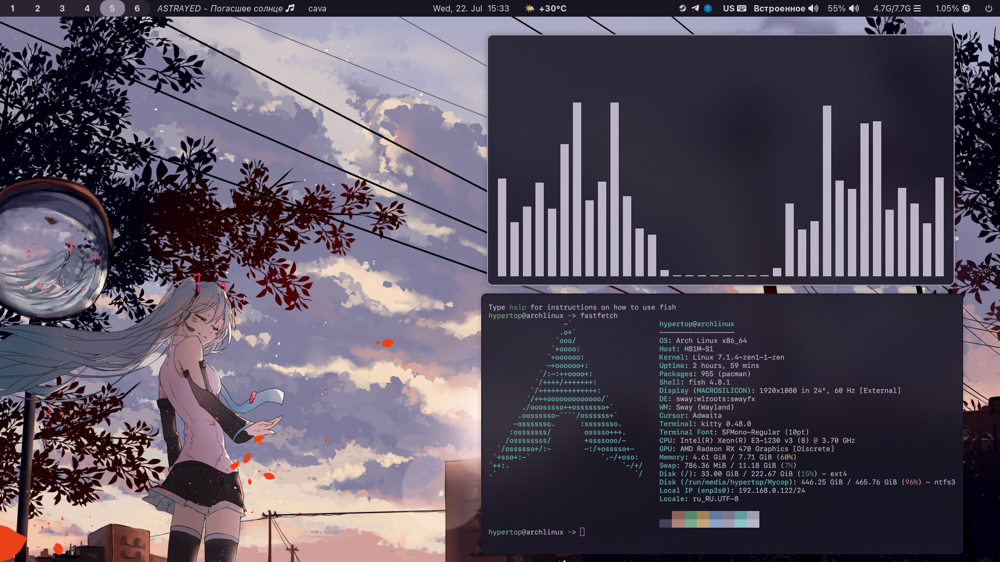

[English](README.en.md) | [Русский](README.md)

# VildanG's Miku Sway dotfiles



## Requirements
```
sudo pacman -S sway swayfx-git waybar wofi kitty alacritty polkit-gnome playerctl
yay -S otf-apple-sf-pro otf-apple-sf-mono
```

## Installation
```bash
# SwayFX
cp sway/config ~/.config/sway/config

# Waybar
cp waybar/config ~/.config/waybar/config
cp waybar/style.css ~/.config/waybar/style.css

# Scripts
cp scripts/*.sh ~/.config/waybar/scripts/
chmod +x ~/.config/waybar/scripts/*.sh

# Kitty
cp kitty/kitty.conf ~/.config/kitty/kitty.conf

# Wofi
cp wofi/style.css ~/.config/wofi/style.css

# Wallpaper
cp wallpaper.jpg ~/Wallpaper/wallpaper.jpg
```

## Monitor setup
Edit these lines in `~/.config/sway/config`:
```
output DP-1 resolution 1920x1080@144.001Hz
output HDMI-A-1 resolution 1920x1080
focus output DP-1
workspace 1 output DP-1
workspace 2 output HDMI-A-1
```

## Keybindings

### Launch
| Key | Action |
|-----|--------|
| Win+Return | Terminal (Kitty) |
| Win+B | Firefox |
| Win+T | Telegram |
| Win+E | Dolphin |
| Win+R | Wofi (launcher) |

### Windows
| Key | Action |
|-----|--------|
| Win+Q | Close window |
| Win+F | Fullscreen |
| Win+Shift+Space | Toggle floating |
| Win+S | Stacking layout |
| Win+W | Tabbed layout |
| Win+Shift+R | Resize mode |
| Win+←↑→↓ | Focus window |
| Win+Shift+←↑→↓ | Move window |

### Workspaces
| Key | Action |
|-----|--------|
| Win+1..0 | Switch workspace |
| Win+Shift+1..0 | Move window to workspace |
| Ctrl+Shift+1..0 | Move window to other monitor |
| Ctrl+Scroll | Prev/next workspace |

### Screenshots
| Key | Action |
|-----|--------|
| Print | Fullscreen → clipboard |
| Win+Print | Area → clipboard |
| Ctrl+Shift+Print | Area (drag mode) → clipboard |

### System
| Key | Action |
|-----|--------|
| Win+Shift+C | Reload config |
| Win+Shift+E | Exit Sway |
| XF86AudioRaiseVolume | Volume +5% |
| XF86AudioLowerVolume | Volume -5% |
| XF86AudioMute | Mute |

### Dragging windows
- Win+Shift+Space — make window floating
- Win+left click on border — drag
- Win+right click on border — resize

## Waybar modules
- **Left**: workspaces, mode, now playing, window title
- **Center**: clock, weather (wttr.in/Nizhnekamsk)
- **Right**: system tray, keyboard layout (US/RU), audio output, pulseaudio, memory, CPU, power
